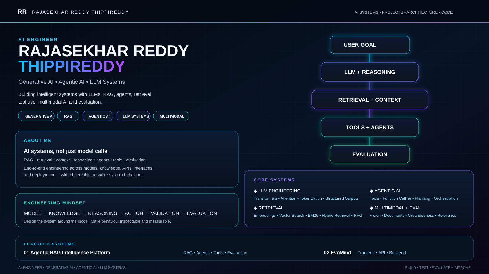

 

  ## PROJECTS
  

# Agentic-rag-intelligence

# Evomind

  

---

## 🌐 Socials:
  

# 💻 Tech Stack:
                                                                                
# 📊 GitHub Stats:

  
 
 

## 🏆 GitHub Trophies

### 🔝 Top Contributed Repo

<!-- Proudly created with GPRM ( https://gprm.itsvg.in ) -->

---

## ◈ Current Focus

`Agentic AI` · `RAG Architecture` · `LLM Systems` · `Multimodal AI`  
`AI Evaluation` · `Retrieval Engineering` · `AI Application Architecture`

---

### Build · Test · Evaluate · Improve

